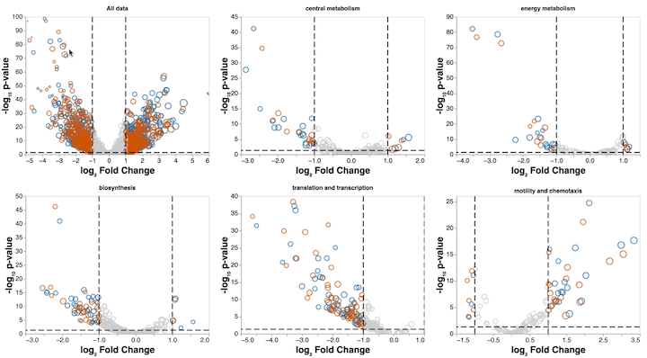

The following interactive visualizations are supplementary figures to accompany the RNA-seq results discussed in "A methanotrophic bacterium to enable direct methane capture for climate mitigation" by _He et al._ Manuscript in preparation. 

In order to facilitate deeper exploration of significant differentially expressed genes in _M. buryatense_ 5GB1c when grown in limited CH4conditions, these charts are enabled with hover tooltips, custom selections, and pan + zoom functions. 

# Visualization gallery

    <table>
        <tr>
            <th>
                
Figure 3, interactive 

            </th>
            <th>
                
Exploration of significant genes

            </th>
        </tr>
        <tr>
            <td>
                <a href="figure3.html" title="Go to interactive visualization" display='inline'>
                    
                    
Interactive version of Figure 3 volcano plots

                </a>
            </td>
            <td>
                <a href="volcano_3window.html" title="Go to interactive visualization" display='inline'>
                    
                    
Investigate significant genes in central metabolism

                </a>
            </td>
        </tr>
    </table>

